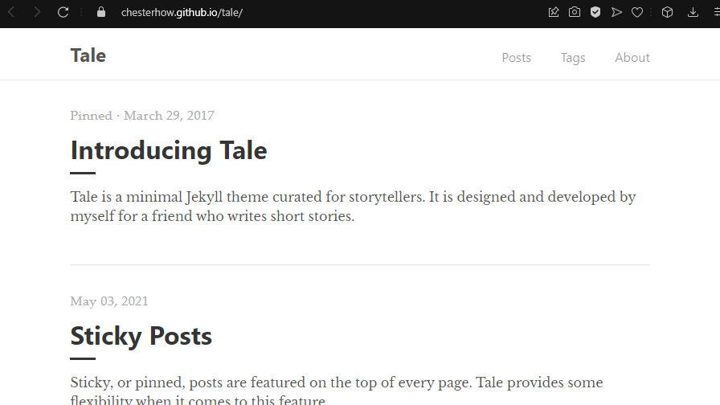

I always want to journal everything I learn, and occasionally want to write about a certain topic and how to feel about it. But I always felt like didn't have time to do this because writing code on a daily basis exhausted me already. However, later discovered that my time was being wasted in entertainment and distraction, which also consumed my energy, rather than doing productive things.
<!--more-->
So, a few weeks ago, I decided to make some changes to the way I learn. I know that understanding or memorizing something is easier than writing it down. But by writing it on a note, I believe I will be able to share it with someone in need and also look back on it in the future.
  

（=´∇｀=）

  

## Blogging, The Hard Way
When it comes to managing content on websites or blogs, it is easier to pick a CMS such as WordPress. However, WordPress has grown to be enormous and somewhat bloated, with far more features than I need to create a simple blog. Don't get me wrong: WordPress is a good general-purpose content management system that can be used to build any type of website. When something becomes general purpose, it will have many features to meet any needs. I need a tool that only helps me write posts and loads blazing fast. Most of the lightweight CMSs that I used to work with many years ago are now obsolete. That's when I discovered the static site generator.
  
As previously stated, Some of you may wonder, "Why a static site? Wouldn't a dynamic website will be better?". In some cases, such as when developing a web service, a dynamic site will be extremely beneficial, and a database will be required. However, because of the database, your website must communicate with it to retreive content, the page will load slower depending on how complex your query and data calls are. Because the content of static websites is written in plain html, they lack databases. Your page will load faster because database queries won't be necessary anymore. 
  
Creating a static site for your blog does not necessarily make your life easier. While the database is absent, our actual site's size may gradually grow. Also, utilizing a static site generator means that each time we make a change to a website appearance, and edit or update an article, we must work with the website's source code. I believe that static site generator is appropriate for developers who are familiar with modern web development tools.
  

## Preparation
Before we can create a website with static site generator, we must first set up a few things:
- installing ruby
- installing bundler and jekyll

### Installing ruby
According to ruby website, Ruby is a dynamic, interpreted, open source programming language with a focus on simplicity and productivity. But in this case, we only need it to download the necessary packages for our static site generator. Download Ruby at the following URL.

https://www.ruby-lang.org/


### Installing bundler and jekyll
After installing ruby, we can use `gem` command to install `bundler` and `jekyll` globally. According to Bundler's site, [Bundler](https://bundler.io) provides a consistent environment for Ruby projects by tracking and installing the exact gems package and versions that are needed, I think it is similiar to `npm` on NodeJS. While [Jekyll](https://jekyllrb.com) is a static site generator based on Ruby. Open Command Prompt on windows or Terminal on Linux, and then type :

gem install bundler jekyll

The installation process may take a while to complete.
  

## Cloning A Theme
You can always create a Jekyll project by typing `jekyll new my-new-website` if you are already experienced in website building and want to build your own theme from scratch. For myself, I'm just using available theme to speed things up. First, assuming that we already have a Github account and installed Git on local machine, I'm going to fork the theme repository that I found it fits my needs below :

https://github.com/chesterhow/tale

If you want another theme you can always find them at `https://jekyllthemes.io`. The name of the newly forked repository must be match with the domain that other people will use to access this website; in my case, I chose `eggbitramen.github.io`. Don't forget to set the repository to public.
  
Then we need to clone the newly forked repository to our local computer :

git clone https://github.com/eggbitramen/eggbitramen.github.io.git

And then we need to change our directory to that project folder :

cd eggbitramen.github.io

Inside that project folder, we need to download all of gem packages that required by this theme to generate a static site. It can be simply done by typing :

bundle install

Basically, all of the preparation has been completed, and the only thing left is to test it to see if it will work.

bundle exec jekyll serve

The previous command will establish a local web server that can be accessed at `http://127.0.0.1:4000` and "compile" our source code into a production-ready website under the `_site` folder. However, programming without encountering an error isn't very interesting, isn't it? well, I encountered one error. Apparently ruby 3.x does not includes `webrick` by default that required by this theme, so my website couldn't start. we need to add webrick manually to resolve this issue :

bundle add webrick

Then we could run the development server again and see if it will work :

bundle exec jekyll serve

When the development server is running, everytime we make a change to our website, the web server will automatically compile our source code. To stop this we could press `ctrl + C` on the command prompt to terminate the service.
  
## Make Some Changes
I made some changes to this newly created blog before adding any content to make it feel more personal and customized. The change isn't necessarily significant; I kept it simple so that it wouldn't take too long to publish. Aside from changes to the blog's information, I also altered its appearance a little bit.

### Changing Site Info
Every Jekyll theme must include one file that defines site information such as title, description, and so on. This file is called `_config.yml` in our theme. So, open `_config.yml` and make some changes. You can use any text editor like VSCode, Atom, or Vim.

# Site settings
title:          eggbitramen's archive
description:    "Here lies my legacy"
#baseurl:        "/tale"
url:            "https://eggbitramen.github.io"

# Author
author:
  name:         Tamago Ramen Hito
  url:          https://eggbitramen.github.io
  email:        eggbitramen@gmail.com

We'll focus on lines 1 through 15. I changed the title, description, URL, and author of this website. I also commented out the `baseurl:` field because it was unnecessary at the time. By the way, many thanks to Chester How for creating the theme.

### Changing Site Looks
I won't go into detail about how I changed the look of the website. You can try it yourself by modifying SASS files in the `_sass` folder. Basically, I changed the entire website theme to dark mode and added some accents to the top of pages to help visitors remember my blog.
  

_original theme_

 

_altered theme_

 

## Creating a Post
Creating a blog post with the Jekyll static site generator differs from creating a post with a CMS, there is no dasboard, there is neither a text field nor a rich text editor. To format text, all you need is a text editor like VSCode or Vim, and [markdown](https://www.markdownguide.org). Writing in markdown is similar to writing in plain HTML, but in my opinion, it is simpler. Each post is written in a file under the `_posts` folder, with a name that begins with a date prefix followed by the post title. So, if we want to publish a post titled "Hello Static" by August 1, 2022, the file name must be `2022-08-01-hello-static.md` with the markdown extension.
  
Let's create a post under `_posts` folder :

touch ./_posts/2022-08-01-hello-static.md

Then open the newly created file with the text editor. I copied the post templates that this theme uses. The following example will go over setting post information, author name, adding tags, and managing excerpts.


---
layout: post
title: "Hello Static"
author: "eggbitramen"
tags: General
excerpt_separator: <!--more-->
---

Hello static site with jekyll...
<!--more-->
Nullam interdum ultricies nibh quis sollicitudin. Donec ornare fermentum facilisis. Ut at sem ac sem imperdiet varius a eget tortor. Nam eu augue eget orci semper maximus in eget augue. Mauris ornare, nisl ut suscipit consectetur, mi quam interdum tellus, at rutrum quam eros ultrices mi.

 
Let's break down the previous example post, the `layout:` field will select one of the predefined layouts in the `_layout` folder. For the now, it could be a post, home, or default layout. The title, author, and tags fields are self-explanatory. we can define the post title, author's name, and add tags with space separated. The excerpt separator field specifies the separator to be used. It is `<!—more—>` in this case. The text preceding the separator will appear as a post preview, and the text following it will appear after the visitor has clicked the full post or 'read more'.
  
After creating a post, we need to build our website source code :

bundle exec jekyll build

The command above will only build the source code without starting the development server. If we also want to start the development server we could type :

bundle exec jekyll serve

  

## Publishing to Github Pages